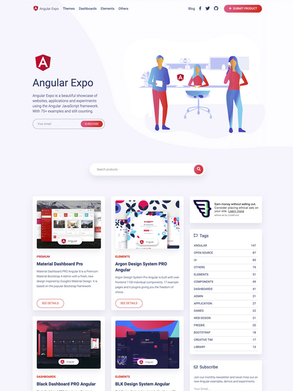

# [Angular Expo](https://angularexpo.com/)     

## Angular Expo is a beautiful showcase of websites, applications and experiments using the Angular JavaScript framework. With 75+ examples and still counting.

## Special Thanks

Creative Tim: <https://www.creative-tim.com/?ref=angularexpo-readme>

IRA Design: <https://iradesign.io/?ref=angularexpo-readme>

Galio: <https://galio.io/?ref=angularexpo-readme>

## Useful Links

For React websites, applications and experiments check Made with React: <https://madewithreact.com/?ref=angularexpo-readme>

For VueJS websites, applications and experiments check VueJS Expo: <https://vuejsexpo.com/?ref=angularexpo-readme>
